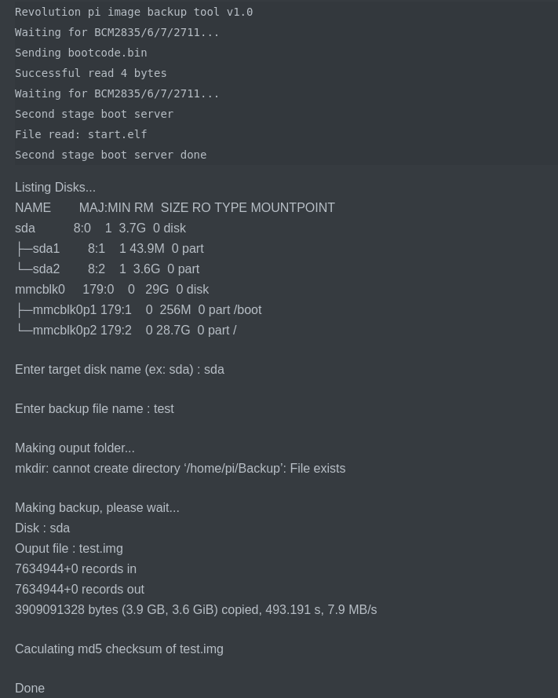
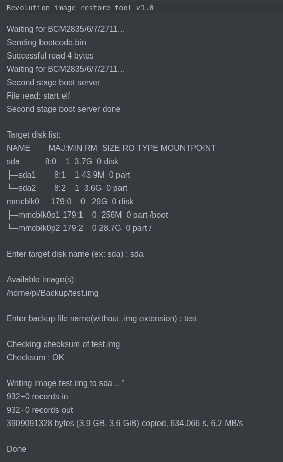

# Raspberry compute module image reader/writer

- 2022-08-01 v1.1 Change default ouput folder
- 2020-06-09 v1.0 Init 

## 0.接続
- RevPiの限限を切る  
- microUSBケーブルでRevPiとバックアップ実行用のPiに接続  
- RevPiの電源を入れる
- バックアップやリストアはバックアップ実行用のPiで行う。
- バックアップ時間 : 約10分間(revPi core3の場合)

## 1.バックアップ
- sshでバックアップ実行用のPiに接続する
- <code>cd Code/raspberry-cli-backup-tool</code>コマンドを実行する  
- <code>./backup.sh -b</code>コマンドを実行する  
- RevPiがマウントされた後、<b>ディスク名</b>や<b>バックアップファイル名</b>を入力する
- 出力ファイルとチェックサムが<code>/Backup</code>に出力される。 

#### 実行例

## 2.リストア
- sshでバックアップ実行用のPiに接続する
- <code>cd Code/raspberry-cli-backup-tool</code>コマンドを実行する  
- <code>./restore.sh -b</code>コマンドを実行する  
- RevPiがマウントされた後、<b>ディスク名</b>を入力する  
- リストされた<b>バックアップファイル名</b>のいずれかを入力する  
- チェックサムが正常の場合、データ書き込みが実行される
- リストア時間 : 約20分間(revPi core3の場合)

#### 実行例
